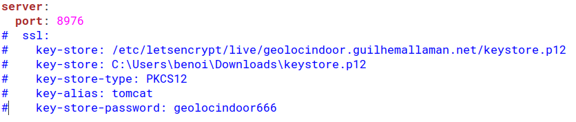

# GeoLocIndoorApi
## Attention
Pour lancer l'application sans https mettez en commentaire la partie en bleue : 

* Pour tester les routes de l'API REST : 
    * http://localhost:8976/api/swagger
    
* Pour lancer les tests : 
    * `./gradlew test`

* Pour lancer l'application : 
    * `./gradlew bootRun`
 
* Pour generer un jar :
    * `./gradlew bootJar`
    * Et lancer le jar : `java -jar GeoLocIndoorApi.jar`

* Pour generer un war :
    * `./gradlew bootWar`

* Accessible sur : http://localhost:8976/api
* Pour changer le port 8976 en 8888 : 
    * src/main/resources/application.yml et changer `server.port: 8888`
    * lancer `./gradlew bootRun -Dserver.port=8888`
    * lancer le jar avec `java -jar GeoLocIndoorApi.jar --server.port=8888`