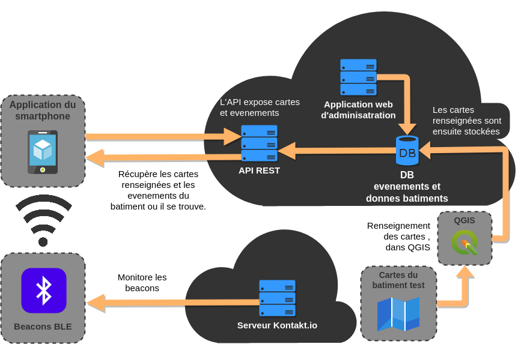
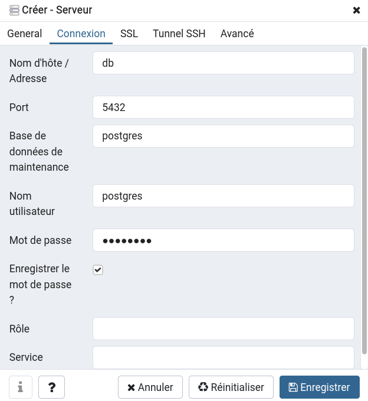

# GeoLocIndoor
GeoLocIndoor est une solution prototype pour permettre la géolocalisation et la guidage à l'intérieur des bâtiments a l'aide d'un smartphone Android.


## Structure du projet
Le projet GeoLocIndoor est composé de différentes parties :

### Front-end
```bash
.
├── GeoLocIndoorAndroid #Application mobile (Android)
```

### Back-end
```bash
.
├── ci-cd #Images Docker pour la CI et le docker-compose
├── GeoLocIndoorApi #API REST pour manipuler la DB (Springboot)
├── GeoLocIndoorCommon #Modeles communs du projet (JPA)
├── GeolocIndoorWeb #Application web d'administration (Angular)
├── qgis #Projet QGIS utilise pour creer les donnees du batiment
├── README.md #Documentation du projet
```

## Pre-requis
#### Gradle [version 6.1]
https://gradle.org/install/

```bash
#Installation
cd ~/Downloads
curl https://services.gradle.org/distributions/gradle-6.1-bin.zip
sudo mkdir /opt/gradle
unzip -d /opt/gradle gradle-6.1-bin.zip

#Set le $PATH
export PATH=$PATH:/opt/gradle/gradle-6.1/bin

#Verification
gradle -v
```

### Front-end
#### Android Studio
https://developer.android.com/studio

```bash
cd ~/Downloads

#Installation
curl https://dl.google.com/dl/android/studio/ide-zips/3.6.1.0/android-studio-ide-192.6241897-linux.tar.gz
tar -xvf android-studio.tar.gz
sudo mv ./android-studio /opt
sudo apt-get install libc6:i386 libncurses5:i386 libstdc++6:i386 lib32z1 libbz2-1.0:i386 #Uniquement pour les machines 64bits

#Lancer Android Studio
cd /opt/android-studio/bin
bash studio.sh
```

#### Java [version 8] (Si on ne lance pas l'application android depuis Android Studio)
```bash
#Installation
sudo apt-get install openjdk-8-jdk

#Set le $PATH (si il n'est pas deja fait)
export JAVA_HOME=/usr/lib/jvm/java-8-openjdk-amd64
export PATH=$PATH:$JAVA_HOME/bin

#Pour switcher de version de JDK (si une version etait deja intallee ou pour revenir a une ancienne version)
sudo update-alternatives --config java

#Verification
java -version
```

### Back-end


#### Java [version 11]
https://openjdk.java.net/install/

```bash
#Installation
sudo apt-get install openjdk-11-jdk

#Set le $PATH (si il n'est pas deja fait)
export JAVA_HOME=/usr/lib/jvm/java-11-openjdk-amd64
echo $JAVA_HOME

export PATH=$PATH:$JAVA_HOME/bin

#Pour switcher de version de JDK (si une version etait deja intallee ou pour revenir a une ancienne version)
sudo update-alternatives --config java

#Verification
java -version
```

#### NPM [version 6.X] / NodeJS [version 12.X]
```bash
#Installation
curl -sL https://deb.nodesource.com/setup_12.x | sudo -E bash -
sudo apt-get install nodejs

#Verification
node -v
npm -v
```

## Lancement des projets (natif)
Voir README.md de chaque sous projet


## Lancement des projets (docker-compose)
### Pre-requis
#### Docker
https://docs.docker.com/install/linux/docker-ce/ubuntu/

```bash
#Instalaltion
sudo apt-get update

sudo apt-get install \
    apt-transport-https \
    ca-certificates \
    curl \
    gnupg-agent \
    software-properties-common
    
curl -fsSL https://download.docker.com/linux/ubuntu/gpg | sudo apt-key add -

sudo add-apt-repository \
   "deb [arch=amd64] https://download.docker.com/linux/ubuntu \
   $(lsb_release -cs) \
   stable"
   
sudo apt-get update

sudo apt-get install docker-ce docker-ce-cli containerd.io

#Verification
docker --version
```

#### Docker-compose
https://docs.docker.com/compose/install/

```bash
#Installation
sudo curl -L "https://github.com/docker/compose/releases/download/1.25.4/docker-compose-$(uname -s)-$(uname -m)" -o /usr/local/bin/docker-compose
sudo chmod +x /usr/local/bin/docker-compose

#Creation du lien symbolique
sudo ln -s /usr/local/bin/docker-compose /usr/bin/docker-compose

#Verification
docker-compose --version
```
### Lancement
```bash
cd geoloc
docker-compose up --build
```

Cette commande va lancer 4 containers : 
* DB Postgres + extension PostGIS
* PgAdmin4
* API REST
* Application web d'administration

Pour modifier les configurations ou connaitre les logins/mdp : docker-compose.yml

#### Container postgres
* Accessible sur : http://localhost:5432
* Les donnes importées au chargement sont dans : GeoLocIndoorApi/src/main/resources/schema-postgresql.sql
* Pour modifier l'image Docker : ci-cd/docker/db/Dockerfile

#### Container pgAdmin4
* Accessible sur : http://localhost:8081
* Pour se connecter au conteneur postgres : 
    * login : root@arxit.com
    * mdp : root
* Puis se connecter a la DB et creer un nouveau serveur : 
    * 
    * Cliquer sur enregistrer et maintenant

#### Container API REST
* Accessible sur : http://localhost:8080
* Le swagger permet de tester tous les end-points de l'API REST
* Pour modifier les paramètres de l'application : GeoLocIndoorApi/src/main/resources/application-dev.yml
* Pour modifier l'image Docker : ci-cd/docker/api/Dockerfile

#### Container application web d'administration
* Accessible sur : http://localhost:4200
* Pour modifier l'image Docker : ci-cd/docker/web/Dockerfile

